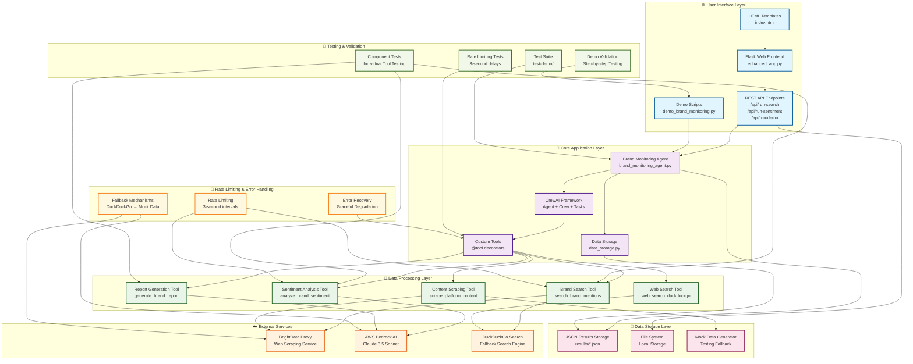
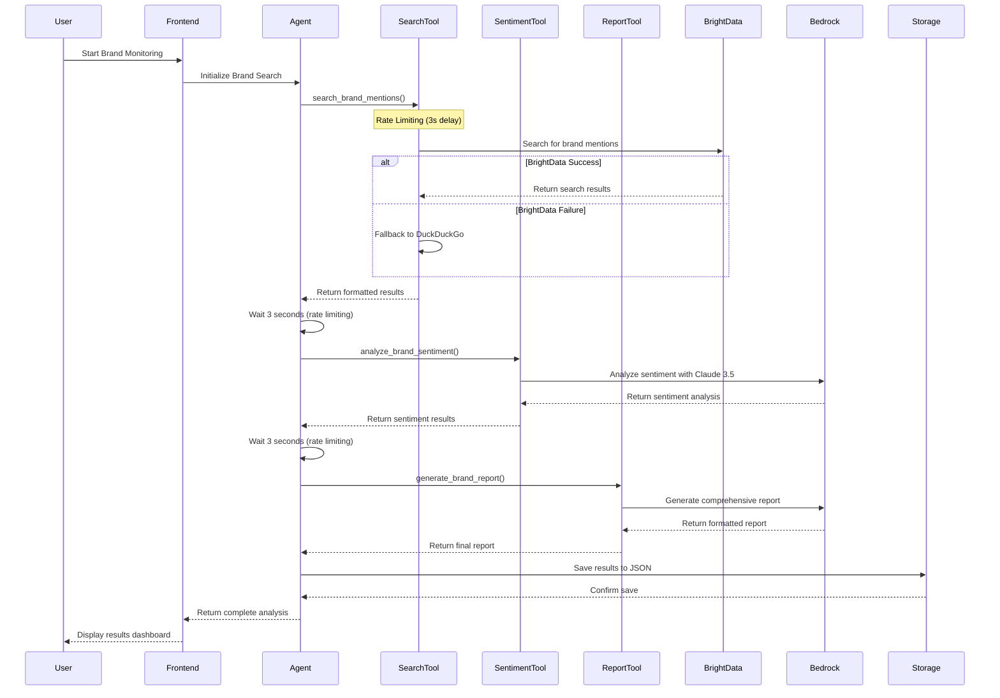
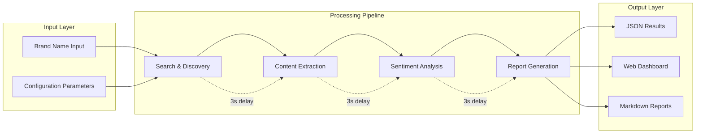
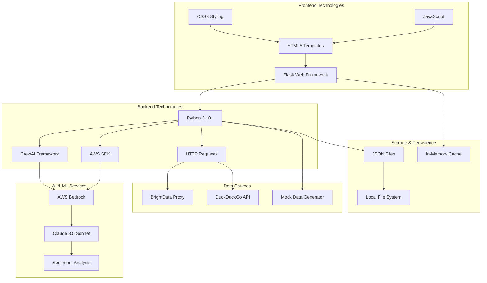

# Brand Monitoring System - Architecture Diagram

## Complete System Architecture

## Data Flow Architecture

## Component Interaction Diagram

## Technology Stack Architecture

## Key Features Highlighted

### 🔄 **Rate Limiting Flow**
- 3-second delays between major operations
- Exponential backoff for failed requests
- Graceful degradation with fallbacks

### 🛡️ **Error Handling Strategy**
- BrightData → DuckDuckGo → Mock Data
- Bedrock failures → Local processing
- Network timeouts → Retry mechanisms

### 📊 **Data Processing Pipeline**
1. **Search**: Find brand mentions
2. **Scrape**: Extract content
3. **Analyze**: Sentiment analysis
4. **Report**: Generate insights
5. **Store**: Persist results

### 🧪 **Testing Architecture**
- Individual component testing
- Integration testing
- Demo validation
- Rate limiting verification

This architecture ensures robust, scalable, and maintainable brand monitoring with comprehensive error handling and testing capabilities.
